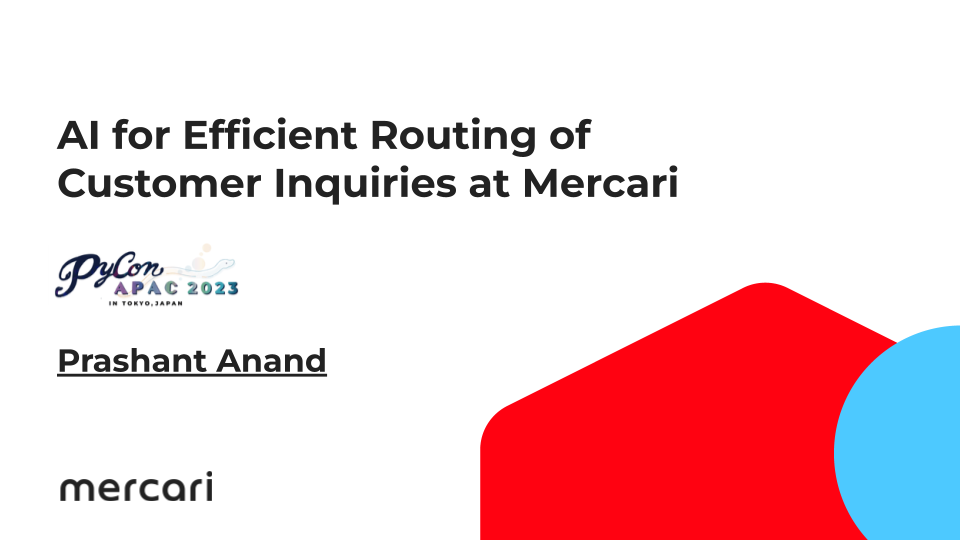

# PyCon APAC 2023 Tech Talk - AI for Efficient Routing of Customer Inquiries at Mercari

## Talk video

Click on the image below to play the video. My talk starts at the timestamp 2:32:33 and it's a half hour talk.

[Link to slides (pdf version)](./pycon-apac-2023-tech-talk-prashant-anand.pdf)

## Abstract

One of the most significant challenges in efficiently handling customer inquiries is routing inquiries to the appropriate customer support agent with the right skills and knowledge to provide prompt and accurate responses. This talk will explore how we use AI for skill-based routing of customer inquiries at Mercari and its business impact.

## Description

Customer support operations can be a significant cost center for businesses. The volume of customer inquiries also grows as a business grows, but the customer support team can't scale linearly with the business. Efficient and effective handling of customer inquiries is the key to keeping the customer support operation costs in check without compromising customer satisfaction. One of the most significant challenges in efficiently handling customer inquiries is routing inquiries to the appropriate customer support agent with the right skills and knowledge to provide prompt and accurate responses. If we fail to route the inquiries to suitable agents, it can lead to long wait times and unsatisfactory resolutions for customers.

In this tech talk, we will explore how AI can be used to predict the skill required to handle customer inquiries. We will discuss the challenges involved in an AI-based routing system, including data collection, model training, and deployment. We will also develop the benefits of AI-based routing, such as a lesser number of transfers, a reduction in customer support operation costs, and a reduced workload for support agents.

## Outline

1. Intro (5 min)
   1. Who am I? (1 min)
   2. Why do we need a routing algorithm for customer inquiries? (1 min)
   3. Why do we need a better algorithm than random allocation? (3 min)
2. Designing a simple skill-based routing algorithm (5 min)
   1. Assigning skills based on the inquiry category selected by the customer (2 min)
   2. Assigning skills using a keyword-matching algorithm (3 min)
3. Using AI for skill-based routing (15 min)
   1. Why do we need AI for assigning skills to inquiries (2 min)
   2. How to get labeled data for training an ML model (1 min)
   3. Fine-tuning a pre-trained transformer (4 min)
   4. Adapting trained model for production use (4 min)
   5. Business impact of AI-based routing (1 min)
   6. Challenges in using AI with customer inquiries (3 min)
4. Conclusion (2 min)
5. Q&A (3 min)

## Audience

Developers, data scientists, ML engineers, and business leaders interested in using AI to enhance customer support operations.

## Outcome

Attendees will gain a deep understanding of skill-based routing works. They'll learn how AI can be used to predict the skill required for customer inquiries and the business impact of implementing such a system. They will also gain insight into the technical aspects of developing and deploying an AI-based routing system.
